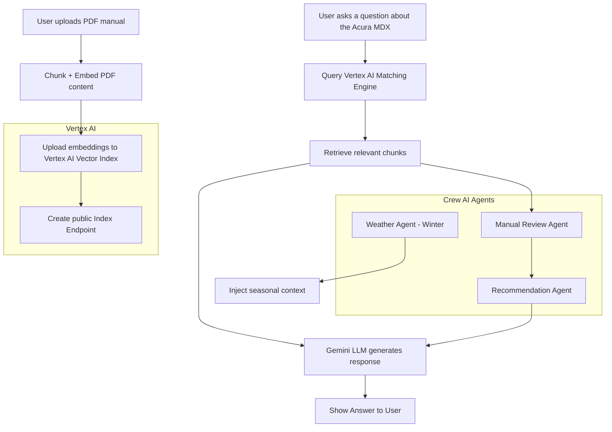

### Vertex AI - Vector Search/Index and Crew orchestration using Gemini LLMs

## 🔗 GitHub Repository

<a href="https://github.com/PrabuAppDev/gcp-google-vertex-ai/blob/main/gcp-vertex-ai-768-dim.ipynb" target="_blank">Vertex Git repo</a>

## Multi-Agent Orchestration: Acura MDX Winterization Workflow

This notebook implements a Retrieval-Augmented Generation (RAG) pipeline to deliver winterization recommendations for the 2022 Acura MDX. It reindexes the owner's manual using 768-dimensional embeddings and orchestrates multiple AI agents to generate actionable outputs using Google Cloud infrastructure.

### Summary of Fix

Earlier attempts failed due to dimensionality mismatches:
> Precondition failed: Query dimensionality (768) does not match database dimensionality (384)

This version resolves that by:
- Switching to the latest `text-embedding-005` model with 768-dimensional output
- Creating a new Vertex AI Matching Engine index and endpoint in `us-central1`
- Uploading correctly formatted JSON datapoints with `id`, `embedding`, and `content`

### Technologies Used

- **Vertex AI**: Hosts the vector index and serves queries via Matching Engine
- **LlamaIndex**: Handles document chunking, embedding, and interfacing with the vector store
- **Crew AI**: Provides multi-agent orchestration with role-based tasks
- **Gemini LLMs**: Used for reasoning, summarization, and checklist generation through Vertex AI

### Multi-Agent Workflow

- **Weather Agent**: Adds contextual seasonal hazards for winter
- **Manual Review Agent**: Extracts vehicle-specific winterization steps from the owner's manual
- **Recommendation Agent**: Compiles a structured winterization checklist in Markdown

This implementation serves as a reusable, extensible template for multi-agent RAG systems grounded in domain documents — integrating LLM reasoning with structured storage and enterprise-ready deployment.

## Vertex Index creation
